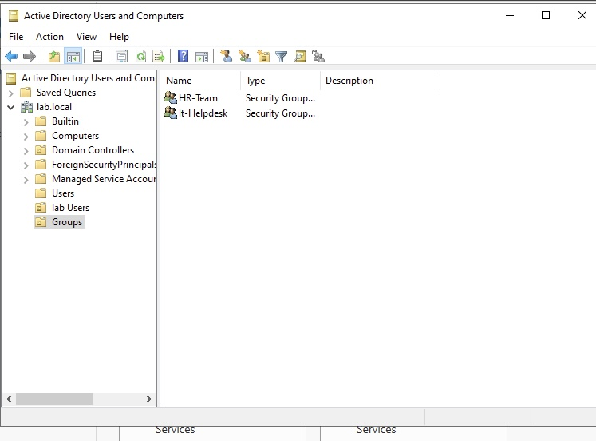
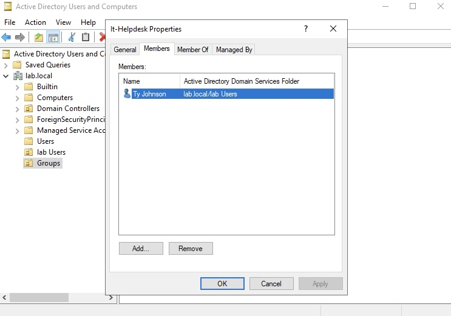
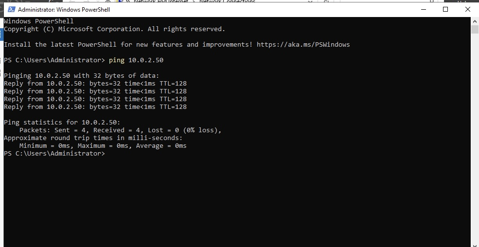

S# Active-Directory-Enterprise-Infrastructure-Home-Lab
## Executive Summary

This project demonstrates the deployment, configuration, and troubleshooting of a centralized Active Directory Domain Services (AD DS) environment using Oracle VirtualBox. The lab features a Windows Server 2022 Domain Controller (`DC01`) and a Windows 11 endpoint (`CLIENT01`) running on a dedicated virtual NAT network.

## Network Architecture & Topology

- **Domain Name:** `lab.local`
- **Subnet:** `10.0.2.0/24`
- **Domain Controller (`DC01`):** `10.0.2.50` | Windows Server 2022
- **Client Workstation (`CLIENT01`):** `10.0.2.15` (DHCP) | Windows 11 Pro

## Implementation Steps

### 1. Active Directory & DNS Configuration

- Provisioned **AD DS** on `DC01` to establish the `lab.local` root domain.
- Configured **DNS Server** roles to handle internal name resolution and domain locating records (`_ldap`, `_kerberos`).
- Created domain user accounts (`johty`, `jdoe`) in **Active Directory Users and Computers (ADUC)**.




## 2. Network Isolation & Troubleshooting

Configured a custom VirtualBox **NAT Network** to allow inter-VM communication while isolating the environment from the physical host network.

Resolved DNS query timeouts by tuning client IPv4 DNS properties and modifying host firewall rules on `DC01` via PowerShell:

```powershell
Set-NetFirewallProfile -Profile Domain,Public,Private -Enabled False

ping 10.0.2.50
nslookup dc01.lab.local
` ``` `


